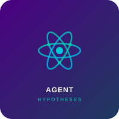
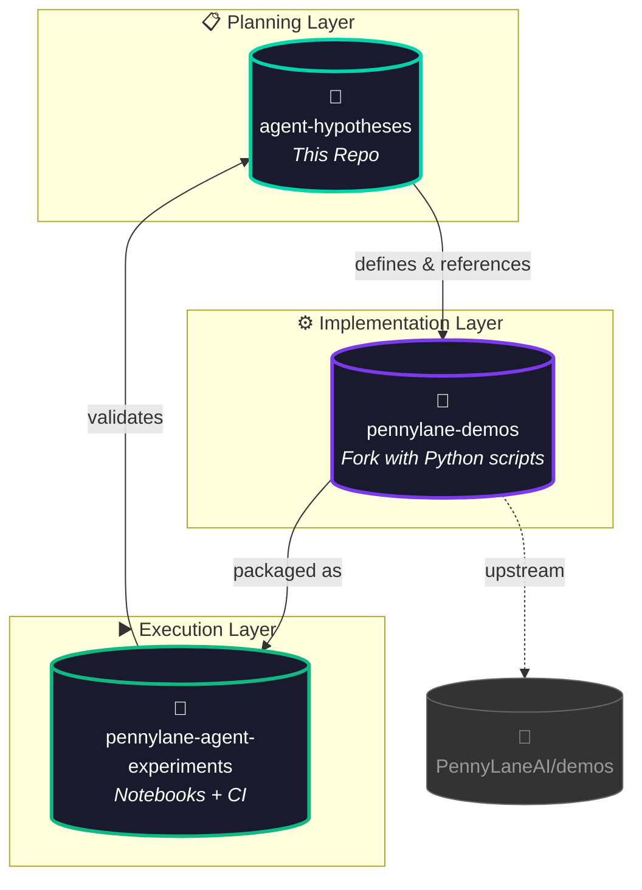
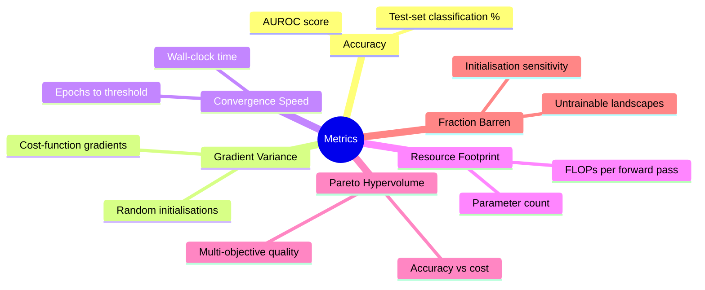

<p align="center">
  <picture>
    <source media="(prefers-color-scheme: dark)" srcset="assets/sticker.svg">
    
  </picture>
</p>

<h1 align="center">🧪 PennyLane Agent Hypotheses</h1>

<p align="center">
  <a href="LICENSE"></a>
  <a href="https://www.python.org/"></a>
  <a href="https://pennylane.ai"></a>
  <a href="https://github.com/NullLabTests/pennylane-demos"></a>
  <a href="https://github.com/NullLabTests/pennylane-agent-experiments"></a>
  <a href="#"></a>
</p>

<p align="center">
  <b>5 ranked, testable hypotheses</b> for agent-driven hybrid quantum/ML experiments<br/>
  using the <a href="https://pennylane.ai">PennyLane</a> demonstration suite.
</p>

<br/>

---

## 🎯 Overview

This repository defines the **research agenda** for a suite of agent-generated experiments exploring practical advantages in hybrid quantum-classical machine learning. Each hypothesis is grounded in recent theoretical results, references concrete PennyLane baselines, and specifies falsifiable metrics with estimated computational cost.

<br/>

### 🔗 Ecosystem



<br/>

### 📦 Sister Repositories

| Badge | Repository | Role |
|-------|-----------|------|
|  | [pennylane-demos](https://github.com/NullLabTests/pennylane-demos) | Fork of PennyLaneAI/demos with Python implementations of each hypothesis |
|  | [pennylane-agent-experiments](https://github.com/NullLabTests/pennylane-agent-experiments) | Runnable notebooks, YAML configs, CI smoke tests |

<br/>

---

## 📋 Hypotheses

<p align="center">

| # | Title | Area | Est. Cost | Status |
|:-:|-------|:----:|:---------:|:------:|
| **H1** | Joint Classical–Quantum NAS for Pareto-Optimal HQNNs |  |  |  |
| **H2** | Engineered Dissipation vs. Local Cost for BP Mitigation |  |  |  |
| **H3** | Post-Variational Strategies on Non-Convex Landscapes |  |  |  |
| **H4** | PDE-Constrained Loss Functions Suppress Gradient Vanishing |  |  |  |
| **H5** | Data-Reuploading with Trainable Scaling on Small Benchmarks |  |  |  |

</p>

Each hypothesis in [`hypotheses.json`](hypotheses.json) includes:

| Section | Description |
|---------|-------------|
| **Description & rationale** | What is being tested and why it matters |
| **Novelty rationale** | How it differs from prior work |
| **Expected metrics** | Quantitative success criteria for falsifiability |
| **Baseline notebook** | Corresponding PennyLane demo path |
| **References** | Supporting papers with arXiv links |

<br/>

---

## 📊 Evaluation Metrics



All experiments share these six metrics for consistent cross-hypothesis comparison.

<br/>

---

## 🚀 Quickstart

```bash
# Inspect the hypothesis definitions
cat hypotheses.json | python -m json.tool

# Run a baseline demo (e.g., H1 — Variational Classifier)
pip install pennylane
python -c "import pennylane as qml; print('PennyLane', qml.__version__)"
```

For executable experiments with notebooks and configs, visit the <a href="https://github.com/NullLabTests/pennylane-agent-experiments"></a> repo.

<br/>

---

## 📁 Repository Structure

```
📦 pennylane-agent-hypotheses
├── 📄 hypotheses.json       # 5 ranked hypotheses (JSON, machine-readable)
├── 📄 README.md             # This file
├── 📄 LICENSE               # MIT License
└── 📁 assets/
    └── 🖼️ sticker.svg       # Project visual identity
```

<br/>

---

## 📄 License

This project is licensed under the **MIT License** — see [LICENSE](LICENSE) for details.
