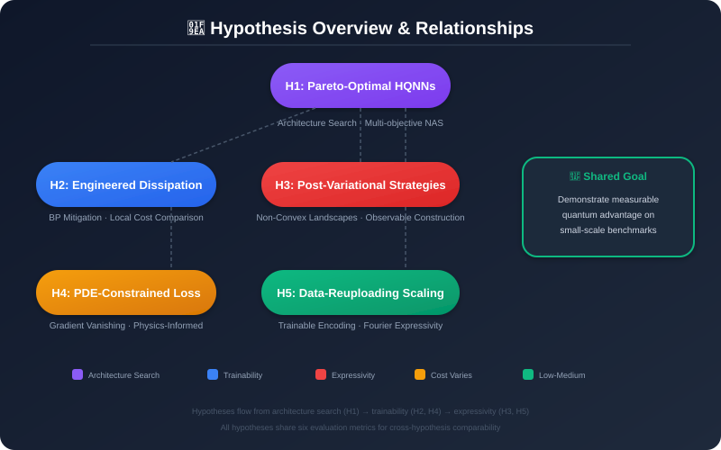
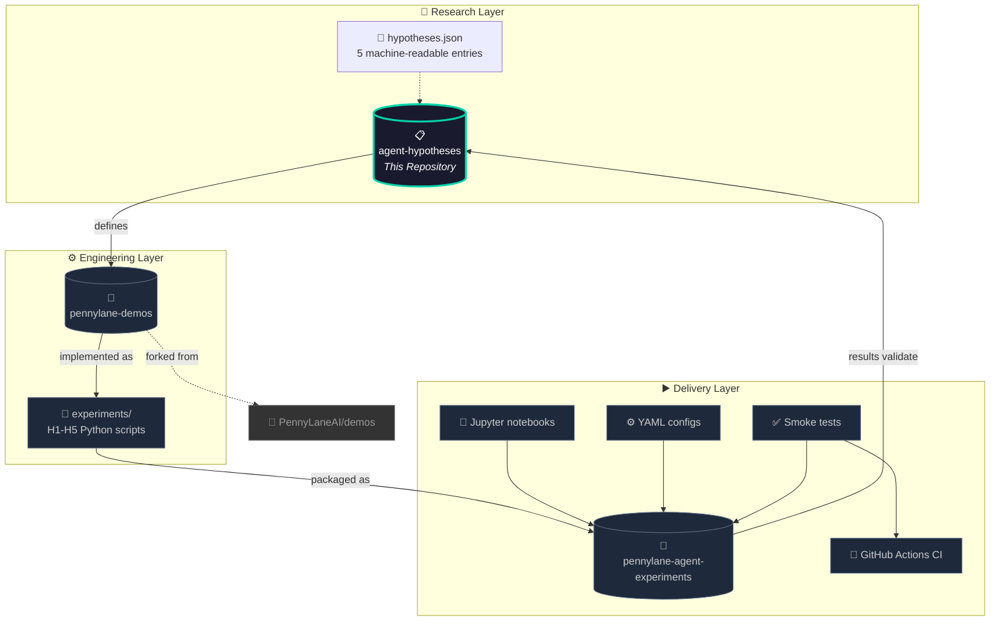
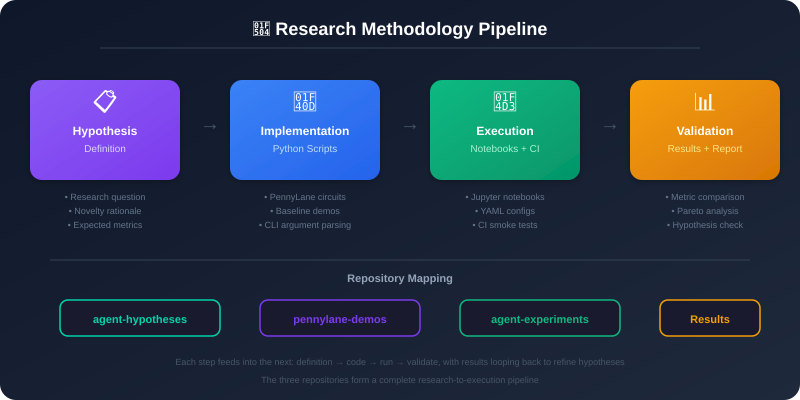
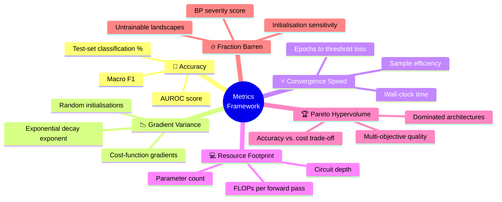
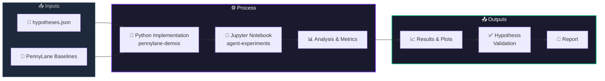

<p align="center">
  <picture>
    <source media="(prefers-color-scheme: dark)" srcset="assets/sticker.svg">
    
  </picture>
</p>

<h1 align="center">🧪 PennyLane Agent Hypotheses</h1>

<p align="center">
  <a href="LICENSE"></a>
  <a href="https://www.python.org/"></a>
  <a href="https://pennylane.ai"></a>
  <a href="https://github.com/NullLabTests/pennylane-demos"></a>
  <a href="https://github.com/NullLabTests/pennylane-agent-experiments"></a>
  <a href="https://github.com/NullLabTests/pennylane-agent-hypotheses/pulse"></a>
  <a href="https://github.com/NullLabTests/pennylane-agent-hypotheses/graphs/contributors"></a>
</p>

<p align="center">
  <b>5 ranked, testable hypotheses</b> for agent-driven hybrid quantum/ML experiments<br/>
  using the <a href="https://pennylane.ai">PennyLane</a> demonstration suite.
</p>

<br/>

---

## 🎯 Mission

> **Identify high-impact directions where hybrid quantum-classical models can demonstrate measurable advantage on small-scale benchmarks.**
>
> Reduce simulator and hardware cost through FLOPs-aware architecture search, engineered dissipation, and post-variational strategies. Improve expressivity and trainability by leveraging neural architecture search, PDE-constrained losses, and trainable encoding schemes.

<br/>

<p align="center">
  
</p>
<p align="center"><sub>Hypothesis relationships: H1 (Architecture Search) branches into trainability (H2, H4) and expressivity (H3, H5) tracks, all feeding into shared evaluation metrics.</sub></p>

<br/>

---

## 🔗 Ecosystem Architecture



<br/>

---

## 📋 Hypothesis Catalog

### How to Read a Hypothesis


<br/>

### H1 — Joint Classical–Quantum NAS for Pareto-Optimal HQNNs

| Attribute | Detail |
|-----------|--------|
| **Area** |  |
| **Cost** |  |
| **Novelty** | Combines (a) the finding that hybridisation eliminates the expressibility–trainability trade-off with (b) FLOPs-aware multi-objective search over the full classical–quantum pipeline |
| **Metric** | Pareto hypervolume improvement over manually designed baselines |
| **Baseline** | [`tutorial_variational_classifier`](https://pennylane.ai/qml/demos/tutorial_variational_classifier) |
| **Refs** | [arXiv:2605.25768](https://arxiv.org/abs/2605.25768), [arXiv:2511.10062](https://arxiv.org/abs/2511.10062) |

### H2 — Engineered Dissipation vs. Local Cost for BP Mitigation

| Attribute | Detail |
|-----------|--------|
| **Area** |  |
| **Cost** |  |
| **Novelty** | First systematic, multi-metric comparison of global cost, local cost, and dissipation strategies using a shared circuit family |
| **Metric** | Gradient variance vs. qubit count; fraction of barren initializations |
| **Baseline** | [`tutorial_barren_plateaus`](https://pennylane.ai/qml/demos/tutorial_barren_plateaus) |
| **Refs** | [npj Quantum Information 10, 88](https://www.nature.com/articles/s41534-024-00875-0), [Cerezo et al. (2021)](https://arxiv.org/abs/2101.11684) |

### H3 — Post-Variational Strategies on Non-Convex Landscapes

| Attribute | Detail |
|-----------|--------|
| **Area** |  |
| **Cost** |  |
| **Novelty** | Tests post-variational methods on the "Better than classical?" benchmark suite — the first study to include these methods |
| **Metric** | Test accuracy vs. classical MLP baseline |
| **Baseline** | [`tutorial_post-variational_quantum_neural_networks`](https://pennylane.ai/qml/demos/tutorial_post-variational_quantum_neural_networks) |
| **Refs** | [arXiv:2312.01486](https://arxiv.org/abs/2312.01486), [arXiv:2403.07059](https://arxiv.org/abs/2403.07059) |

### H4 — PDE-Constrained Loss Functions Suppress Gradient Vanishing

| Attribute | Detail |
|-----------|--------|
| **Area** |  |
| **Cost** |  |
| **Novelty** | Extends the very recent PDE-constrained loss approach across three structurally distinct ansatze and three task types |
| **Metric** | Gradient variance decay exponent; convergence speed |
| **Baseline** | [`tutorial_barren_plateaus`](https://pennylane.ai/qml/demos/tutorial_barren_plateaus) |
| **Refs** | [PDE mitigation (2026)](https://github.com/nimanpra/Barren-Plateau-PDE-Mitigation), [arXiv:2311.04965](https://arxiv.org/abs/2311.04965) |

### H5 — Data-Reuploading with Trainable Scaling on Small Benchmarks

| Attribute | Detail |
|-----------|--------|
| **Area** |  |
| **Cost** |  |
| **Novelty** | Introduces per-dataset grid search over encoding depth and trainable scaling, leveraging the Fourier-series perspective |
| **Metric** | Accuracy gap (percentage points) to classical MLP classifier |
| **Baseline** | [`tutorial_data_reuploading_classifier`](https://pennylane.ai/qml/demos/tutorial_data_reuploading_classifier) |
| **Refs** | [arXiv:2403.07059](https://arxiv.org/abs/2403.07059), [Schuld et al. (2021)](https://arxiv.org/abs/2104.00021) |

<br/>

---

## 🔄 Research Pipeline

<br/>

<p align="center">
  
</p>
<p align="center"><sub>End-to-end pipeline: Hypothesis Definition → Python Implementation → Notebook Execution → Results Validation. The three repositories form a complete research-to-execution lifecycle.</sub></p>

<br/>

---

## 📊 Evaluation Metrics Framework



All six metrics are computed consistently across every experiment for cross-hypothesis comparability.

<br/>

---

## 🗺️ Experiment Pipeline



<br/>

---

## 🚀 Quickstart

```bash
# 1. Inspect the hypothesis definitions
cat hypotheses.json | python -m json.tool | head -20

# 2. Verify your PennyLane installation
pip install pennylane
python -c "import pennylane as qml; print(f'PennyLane {qml.__version__}'); print(f'Device: {qml.about()}')"

# 3. Explore implementations in the sister repos
git clone https://github.com/NullLabTests/pennylane-demos.git
git clone https://github.com/NullLabTests/pennylane-agent-experiments.git
```

| Step | Repo | Command |
|:----:|------|---------|
| 1 | **agent-hypotheses** | `cat hypotheses.json \| python -m json.tool` |
| 2 | **pennylane-demos** | `python experiments/h1_joint_nas_hqnn.py --help` |
| 3 | **agent-experiments** | `jupyter notebook demos/experiments/hypothesis_H1.ipynb` |

<br/>

---

## 📁 Repository Map

```
📦 pennylane-agent-hypotheses
├── 📄 hypotheses.json              # 📋 5 ranked hypotheses (JSON)
├── 📄 README.md                    # ℹ️ This file
├── 📄 LICENSE                      # ⚖️ MIT License
└── 📁 assets/
    └── 🖼️ sticker.svg              # 🎨 Project visual identity
```

**Key file: `hypotheses.json`** — Each entry contains:
```json
{
  "id": "H1",
  "rank": 1,
  "title": "...",
  "description": "...",
  "novelty_rationale": "...",    // Why this is new
  "expected_metric": "...",      // How to falsify
  "estimate_cost": "...",        // Computational budget
  "baseline_notebook_path": "...", // PennyLane demo link
  "min_experiment_steps": 5,
  "refs": ["arXiv:...", ...]
}
```

<br/>

---

## 📚 References

| Area | Key Papers |
|------|-----------|
| **Expressibility-Trainability** | [arXiv:2605.25768](https://arxiv.org/abs/2605.25768) — Rethinking trade-off in HQNNs (2025) |
| **Quantum NAS** | [arXiv:2511.10062](https://arxiv.org/abs/2511.10062) — FAQNAS (2025) |
| **Barren Plateaus** | [npj QI 10, 88](https://www.nature.com/articles/s41534-024-00875-0) — Engineered dissipation (2024) |
| **Cost Functions** | [arXiv:2101.11684](https://arxiv.org/abs/2101.11684) — Cost-function-dependent BPs (2021) |
| **Post-Variational** | [arXiv:2312.01486](https://arxiv.org/abs/2312.01486) — Post-variational QNNs (2023) |
| **QML Benchmarking** | [arXiv:2403.07059](https://arxiv.org/abs/2403.07059) — Better than classical? (2024) |
| **Data Encoding** | [arXiv:2104.00021](https://arxiv.org/abs/2104.00021) — Effect of data encoding (Schuld et al., 2021) |
| **PDE Constraints** | [Barren-Plateau-PDE-Mitigation](https://github.com/nimanpra/Barren-Plateau-PDE-Mitigation) (2026) |

<br/>

---

## 📄 License

This project is licensed under the **MIT License** — see [LICENSE](LICENSE) for details.

---

<p align="center">
  <sub>Part of the <a href="https://github.com/NullLabTests">NullLabTests</a> agent-driven research ecosystem.</sub>
  <br/>
  <sub>
    
    
    
  </sub>
</p>
